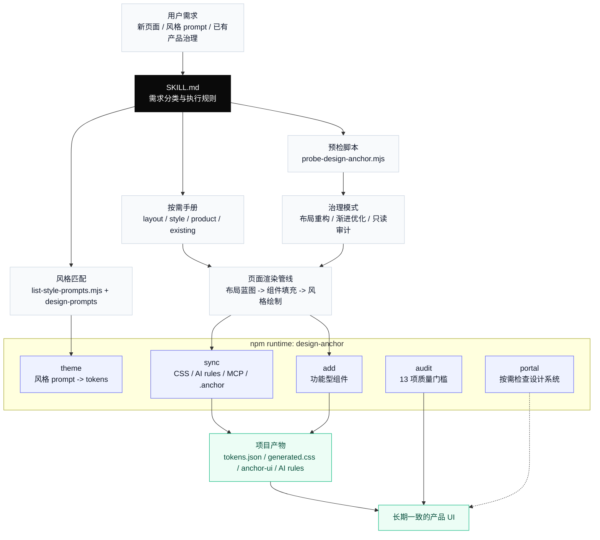

# Design Anchor

[English](./README.en.md)

<p align="center">
  
  
  
  
</p>

<p align="center">
  <strong>把 AI UI 从第一屏的灵感，固定成第一百屏的秩序。</strong>
</p>

Design Anchor 是 [`design-anchor`](https://www.npmjs.com/package/design-anchor) npm 运行时的 AI Skill 层。它不只是让 AI 生成一个好看的页面，而是让 AI 在长期项目里持续读取同一套 token、组件边界、布局原则和质量门槛。

一句话：**开始时帮你定设计方向，维护时帮你守住一致性，审查时帮你发现漂移，修改时帮你整页治理而不伤业务逻辑。**

---

## 产品结构大图



---

## 它解决什么

AI 生成 UI 最大的问题不是第一页不够惊艳，而是长期项目会慢慢失控：按钮颜色微妙偏移、hover 状态各自硬编码、icon 库混用、布局越来越像默认模板。

Design Anchor 给 AI 加上一层稳定的设计记忆：

| 设计问题 | Design Anchor 怎么处理 |
|---|---|
| 风格输入很散 | 把用户 prompt 或内置风格方向提取成 token |
| 页面越做越不一致 | 结构色、交互态、状态色统一走 token |
| 组件要好看又要可用 | 功能型组件走运行时，展示型组件交给 AI 自由设计 |
| 已有产品不能乱改 | 先预检，再让用户选择治理模式 |
| 生成完缺少验收 | 用 13 项质量门槛审查视觉、布局、token、交互和可访问性 |

---

## 四种工作流

| 场景 | Skill 会怎么做 | 关键产物 |
|---|---|---|
| **有清晰设计方向** | 保存 prompt，运行 `theme` 抽取 token，再按视觉方向生成页面 | `tokens.json`、生成 CSS、设计一致的页面 |
| **只有产品想法** | 从内置风格池匹配方向，不暴露内部 preset 名称，直接转 token | 适合场景的风格源 + 首个高完成度页面 |
| **已有成熟产品** | 先预检，再让用户选择 `布局重构`、`渐进优化` 或 `只读审计` | 逐页治理计划和确认后的 UI 改造 |
| **设计系统检查** | 仅在用户明确要看时打开 Portal | tokens、组件、规则和文档检查面板 |

---

## 治理边界

### Token 只管结构，不抹掉个性

| 必须治理 | 保持自由 |
|---|---|
| 主按钮、链接、active、focus 使用 `primary` token | 装饰性渐变、插图色、局部背景 |
| 成功、警告、错误、信息使用语义 token | 数据可视化配色 |
| hover / disabled 从基础 token 派生 | 页面级氛围、阴影、质感 |
| 基础文字色统一 | 风格 prompt 里的 signature elements |

治理的目标是**更精致、更统一**，不是把页面压成黑白线框。

### 功能型组件走运行时，展示型组件自由设计

| 类型 | 策略 | 例子 |
|---|---|---|
| **功能型组件** | `npx design-anchor add <component>` 按需安装 | dialog、command、select、popover、sheet、tooltip、tabs |
| **展示型组件** | AI 根据风格 prompt 自由设计 | 卡片、导航外观、表格布局、数据区、hero、表单排布 |

功能型组件负责可访问性、键盘交互、focus trap、ARIA；视觉表现和页面气质仍由风格 prompt 与 AI 设计判断决定。

### 布局靠原则，不靠模板

布局第一步先判断页面性质：大多数产品页都是 **Functional（工具型）**，例如 dashboard、chat、settings、data table、agent workspace；只有 landing、pricing、product tour 这类页面才是 **Showcase（展示型）**。工具型页面不能被风格 prompt 带成营销页：不加无意义 hero、不塞 feature cards、不写 CTA 式文案。

Design Anchor 用 7 条原则判断页面是否真的适合当前产品：

| 原则 | 检查问题 |
|---|---|
| 目的-布局匹配 | 这个页面的空间结构是否服务主要任务？ |
| 信息层级 | 用户 2 秒内能否看到最重要内容？ |
| 操作层级 | 高频操作是否一眼可达？ |
| 密度适配 | 密度是为任务服务，还是只是装饰？ |
| 空间效率 | 去掉这个模块，用户会不会真的少了什么？ |
| 导航清晰 | 用户跳进这个页面后能否知道自己在哪？ |
| 状态完整 | 空、加载、错误、成功状态是否都设计过？ |

---

## 快速开始

### 安装 Skill

项目级安装：

```bash
mkdir -p .claude/skills/design-anchor
cp -R SKILL.md scripts references agents .claude/skills/design-anchor/
```

个人全局安装：

```bash
mkdir -p ~/.claude/skills/design-anchor
cp -R SKILL.md scripts references agents ~/.claude/skills/design-anchor/
```

Claude.ai 上传时，把顶层目录命名为 `design-anchor` 后再打包；压缩包内部应该是 `design-anchor/SKILL.md`，不要让 `SKILL.md` 直接位于 zip 根目录。

### 安装运行时

在目标产品项目里安装并激活：

```bash
npm install -D design-anchor
npx design-anchor sync
```

如果你使用其他包管理器：

| 包管理器 | 安装 | 激活 |
|---|---|---|
| pnpm | `pnpm add -D design-anchor` | `pnpm exec design-anchor sync` |
| yarn | `yarn add -D design-anchor` | `yarn design-anchor sync` |
| bun | `bun add -d design-anchor` | `bunx design-anchor sync` |

> `probe-design-anchor.mjs` 应该在目标产品根目录运行。对这个 skill 仓库本身运行时，它会把仓库当作普通消费项目扫描，因此会出现“缺少 package.json / 建议安装 runtime”的提示；这不是 skill 损坏。

---

## 命令速查

| 命令 | 作用 |
|---|---|
| `npx design-anchor sync` | 后台激活治理：token CSS、AI 规则、MCP、本地 `.anchor` |
| `npx design-anchor theme <prompt.md>` | 从设计方向提取 token |
| `npx design-anchor add <component>` | 按需安装功能型组件 |
| `npx design-anchor audit` | 运行设计合规审查 |
| `npx design-anchor hydrate` | clone 后重建本地 `.anchor/` |
| `npx design-anchor portal` | 按需查看设计系统，不作为普通 UI 生成入口 |

---

## 交付物边界

| 层级 | 路径 | 是否提交 |
|---|---|---|
| Token 源文件 | `src/design-tokens/tokens.json` | 提交 |
| 生成 CSS | `src/styles/design-tokens.generated.css` | 提交 |
| 功能型组件源码 | `src/components/anchor-ui/` | 提交 |
| AI 规则 | `AGENTS.md` / `CLAUDE.md` / `.cursor/rules/` | 按项目策略提交 |
| 本地控制面 | `.anchor/` | 不提交，可由 `sync` / `hydrate` 重建 |

业务代码只从 `@design` 或 `@/components/anchor-ui` 引入组件，不从 `.anchor/` 或 `node_modules/design-anchor/` 深层路径导入。

---

## 目录结构

```text
design-anchor/
├── SKILL.md                        # AI 入口：分类、规则、渲染管线
├── agents/
│   └── openai.yaml                 # OpenAI agent metadata
├── scripts/
│   ├── probe-design-anchor.mjs     # 项目预检：成熟度、技术栈、icon、布局信号
│   └── list-style-prompts.mjs      # 风格池 metadata
└── references/
    ├── project-contract.md         # 文件边界、source/consumer 判断
    ├── govern-existing-product.md  # 已有产品治理流程
    ├── layout-governance.md        # 布局原则、组件策略、icon 规则
    ├── product-context.md          # 产品类型和页面目的
    ├── style-source-selection.md   # 风格来源选择
    ├── style-prompt-guidance.md    # 风格 prompt -> token 指南
    ├── design-prompt-pool.md       # 内置风格池格式
    ├── portal-routing.md           # Portal 使用时机
    └── design-prompts/             # 26 套内置风格方向
```

---

## 内置风格池

风格文件位于 `references/design-prompts/`。每个文件都带 frontmatter，用于匹配产品类型、密度、语气和明暗模式。

新增风格时，至少包含这些字段：

```yaml
---
name: "Internal Name"
slug: "stable-slug"
user_facing_direction: "给用户看的风格方向"
best_for:
  - "适合的产品或场景"
keywords:
  - "匹配关键词"
density: "compact | balanced | spacious | command-center"
tone: "focused, trustworthy, friendly"
mode: "light | dark | mixed | either"
---
```

内部 prompt 名称不直接展示给用户；对外只表达产品化的风格方向。

---

## 质量门槛

每次 UI 修改后都应通过 13 项自检：

| # | 门槛 |
|---|---|
| 1 | 视觉完成度高，不是线框图或默认模板 |
| 2 | 文本满足 WCAG AA 对比度 |
| 3 | 所有交互元素有 hover / focus |
| 4 | 空、加载、错误状态完整 |
| 5 | 320、768、1024、1440px 常见视口不破版 |
| 6 | 结构色使用语义 token |
| 7 | 主色在全产品一致 |
| 8 | hover、focus、disabled 派生一致 |
| 9 | 单一 icon 库 |
| 10 | 表单字段有可见 label |
| 11 | 破坏性操作有确认门槛 |
| 12 | 键盘可达 |
| 13 | 页面加载无布局跳动 |

---

## 设计思路

**确定性预检**：脚本在 AI 会话前扫描项目，输出结构化 JSON，让 AI 少猜一点。

**渐进加载**：`SKILL.md` 负责路由，references 只在相关场景加载，避免上下文被一次性塞满。

**模式觉察**：受 [Impeccable](https://github.com/pbakaus/impeccable) 启发，拦截的是 AI 无意识默认输出，不是禁止有意图的设计选择。

**原则驱动**：布局治理基于质量原则，而不是固定模板。AI 可以自由设计，但必须能解释为什么这样布局。

---

MIT
